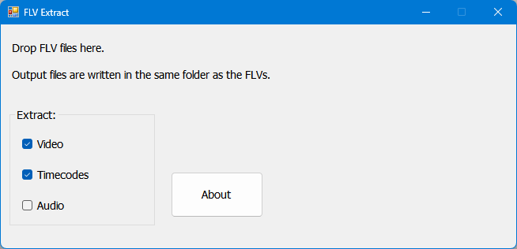
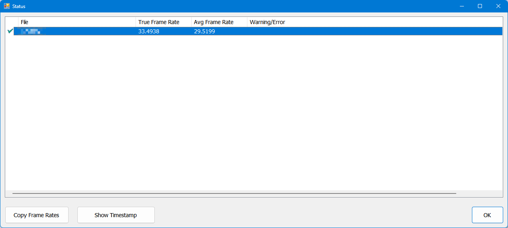
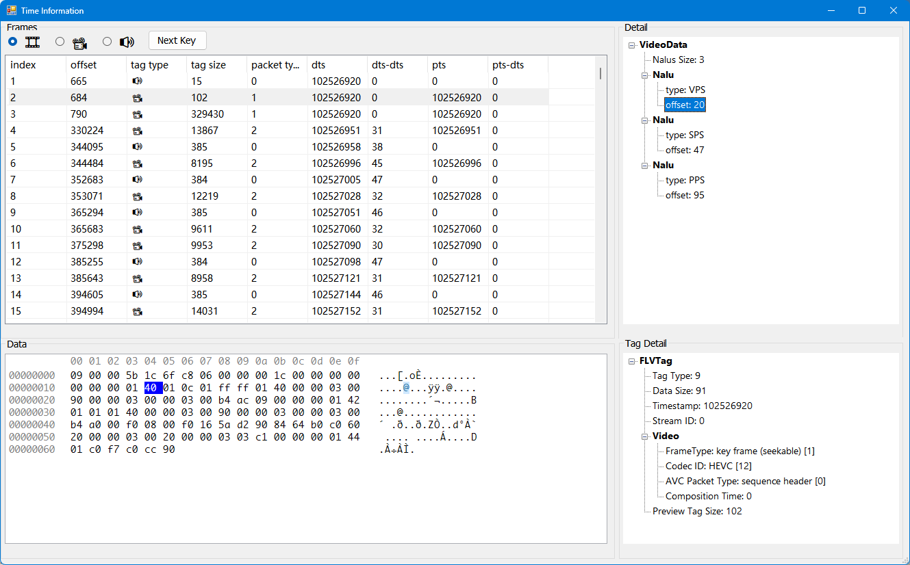

# FLVExtract - demuxer for flv files
## English
### Description
  * Base On [FlvExtract](https://github.com/flagbug/FlvExtract)
  * Support HEVC for codec id 0x09 or 0x0D (always using in **CDN**)
  * support export video stream to .h264 or .h265 and audio stream to .aac etc.
  * support export pts, dts and diff of them 
  * 
## zh_cn
### 描述
  * 基于 [FlvExtract](https://github.com/flagbug/FlvExtract) 修改
  * 支持 codec id 为 09 或者 12 的 HEVC flv 视频流，通常用于 **CDN**
  * 支持导出为 .h264 .h265 .aac 等等
  * 支持导出 pts、dts、pts-dts、dts-dts 用于排障

## USAGE

- start

- result

- hexview

## License
  * [GNU General Public License version 2 (GPLv2)](https://opensource.org/licenses/gpl-2.0)

## References
* A portable (PCL) .NET library that extracts the audio and/or video tracks from FLV files
This library is a PCL port of the FlvExtract library from J.D. Purcell (http://moitah.net/)

## changelog

- 2.1.0(2023/4/24)
  - feat: add time stamp information 
  - feat: add hex view for per Flv Tag
  - feat: key frame jump for video Tag
- 1.7.0 (2023/4/14)
  - feat: add HVCCDecoderConfigurationRecord support
  - UI: big fonts
- Ancient
  - HEVC support
  - dts、pts output 
