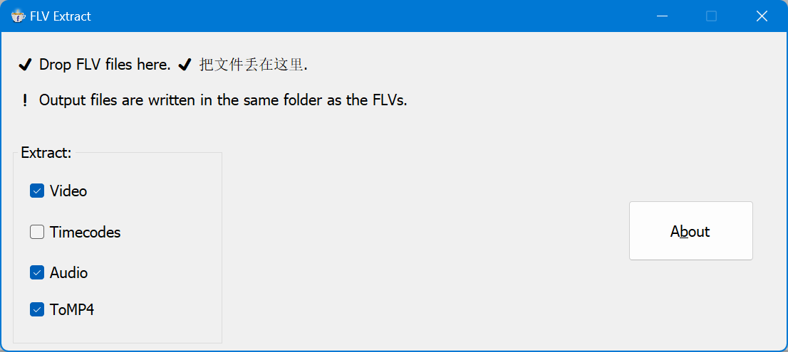

# FLVExtract - demuxer for flv files

## Description
  * Base On [FlvExtract](https://github.com/flagbug/FlvExtract), Thanks to
  * Support HEVC for codec id 0x09 or 0x0D (always using in **CDN**)
  * support export video stream to .h264 or .h265 and audio stream to .aac etc.
  * support export pts, dts and diff of them 
  * support **remuxer** to mp4 (using ffmpeg as backend, which should be in FFmpeg/bin/x64)

## USAGE

- start

- result

- hexview

## License
  * [GNU General Public License version 2 (GPLv2)](https://opensource.org/licenses/gpl-2.0)

## References
* A portable (PCL) .NET library that extracts the audio and/or video tracks from FLV files
This library is a PCL port of the FlvExtract library from J.D. Purcell (http://moitah.net/)

## changelog
- 2.4.0(2024/12/17)
  - feat: change mp4 muxer(FFmpeg should be in FFmpeg/bin/x64)
  - feat: add hevc muxer detector
